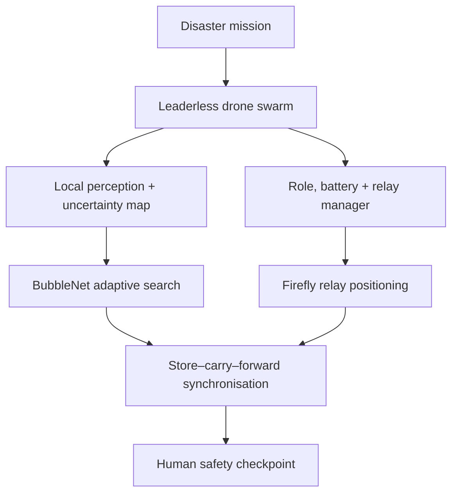
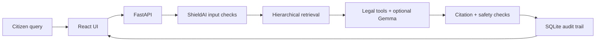
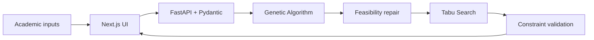
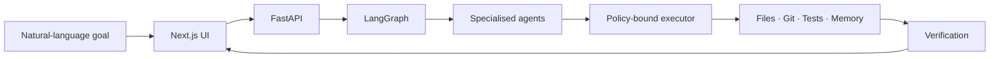

# Shubhi Dixit

Computer Science undergraduate at **Delhi Technological University (DTU)** focused on **Artificial Intelligence, Distributed Systems, Competitive Programming, and Software Engineering**.

I enjoy transforming ambitious ideas into working systems—from leaderless disaster-response swarms and privacy-aware AI tools to agentic runtimes and combinatorial optimisation platforms. I believe in learning by building, testing and continuously improving.

  <a href="https://www.linkedin.com/in/shubhi-dixit-dtu/">LinkedIn</a> •
  <a href="https://leetcode.com/u/shubhi_dixit_09/">LeetCode</a> •
  <a href="https://codeforces.com/profile/shubhi.dixit.dtu">Codeforces</a>

---

## Featured Projects

I build systems where AI, distributed coordination and algorithms produce observable, verifiable outcomes—not just text responses. These projects explore resilient multi-agent systems, privacy-aware AI, agentic execution and combinatorial optimisation through complete applications.

---

## **JeevanMesh — Self-Healing Disaster-Response Drone Swarm**

A browser-based rescue command center that simulates leaderless drone coordination when communication networks and disaster infrastructure become unreliable.

  

### **Workflow**

`Disaster Mission`   →   `Local Drone Agents`   →   `BubbleNet Search`   →   `Evidence + Uncertainty Map`   →   `Role Reallocation`   →   `Store–Carry–Forward Mesh`   →   `Human Safety Checkpoint`

* Models a **leaderless, partition-tolerant swarm** in which losing one drone or communication link does not stop the rescue mission.
* Allows drones to switch between scout, verifier, communication-relay and supply roles according to mission priority, connectivity and battery state.
* Implements **BubbleNet Adaptive Search**, a whale-inspired confidence-driven spiral that reduced target-discovery time by **39.7% over grid scanning in the controlled prototype scenario**.
* Uses **Firefly Relay Positioning** to score potential relay locations from connectivity gain, survivor priority and energy cost, enabling temporary agents to repair the mesh.
* Preserves discoveries and tasks through **Search–Remember–Recover** and store–carry–forward communication, synchronising buffered information after reconnection.
* Represents survivor detections using confidence, source and recency; conflicting reports request another observation instead of being presented as confirmed truth.
* Visualises drone movement, 3D coordinates, mesh links, survivor heatmaps, battery-aware task inheritance, blocked-route rerouting and **JeevanLink** civilian connectivity.
* Includes a repeatable network-failure demonstration and human approval checkpoint for high-risk rescue recommendations.

<b>View architecture</b>

### **Tech Stack**

Next.js • React • TypeScript • Google Maps JavaScript API • Vite • Multi-Agent Simulation • Distributed Systems

**Repository:** [JeevanMesh](https://github.com/ShubhiDixit09/nsut-JeevanMesh)

---

## **NyayaBot + ShieldAI — Local-First Legal Action Engine**

A local-first legal assistance system that turns an English, Hindi or Hinglish grievance into grounded legal information, actionable procedures and draft documents.

  

### **Workflow**

`React UI`   →   `FastAPI`   →   `ShieldAI Input Guards`   →   `Hierarchical Legal Retrieval`   →   `Tool Workflow`   →   `Optional Gemma`   →   `Output Verification`   →   `SQLite Audit Trail`

* Uses hierarchical offline retrieval to identify the relevant legal domain before narrowing the result to supporting provisions.
* Combines local **TF-IDF retrieval** with an optional Ollama/Gemma layer; a deterministic fallback keeps core workflows usable without the model.
* Applies ShieldAI checks for prompt-injection patterns, configured PII masking, citation presence, grounding and mandatory legal disclaimers.
* Produces practical outputs including procedure checklists, evidence records, case actions and downloadable legal-document drafts.
* Coordinates statutory search, procedure lookup, evidence handling, drafting and verification through a structured tool-driven workflow.
* Stores cases and actions in SQLite with explicit transactions, idempotency validation and compare-and-swap updates for conflict-safe writes.
* Records validation results and execution history so each answer remains traceable rather than appearing as an unexplained model response.

<b>View architecture</b>

### **Tech Stack**

React • TypeScript • Python • FastAPI • SQLite • TF-IDF • Ollama • Gemma • ReportLab • Pytest

Built for the **Build with Gemma Hackathon, AIMS-DTU**.

**Repository:** [NyayaBot + ShieldAI](https://github.com/ShubhiDixit09/NyayaBot.ShieldAI)

---

## **ChronoSync — University Timetable Optimisation**

A full-stack scheduling platform that converts academic requirements into conflict-checked, preference-aware university timetables.

  

### **Workflow**

`Next.js UI`   →   `FastAPI + Pydantic`   →   `Genetic Algorithm`   →   `Feasibility Repair`   →   `Tabu Search`   →   `Validated Timetable + Metrics`

* Models university timetabling as an **NP-hard combinatorial optimisation problem** involving courses, faculty, rooms, laboratories, student groups and time slots.
* Separates hard constraints—such as faculty, room and student-group clashes—from soft objectives such as preferences and schedule quality.
* Uses a **Genetic Algorithm** to explore the global search space, followed by deterministic repair to remove remaining infeasibilities.
* Applies **Tabu Search** as a local-improvement stage to refine feasible schedules without repeatedly revisiting recent solutions.
* Returns generated timetables with conflict reports, warnings, fitness values and convergence information, making optimisation behaviour explainable.
* Provides typed validation, sample-data, generation and health APIs through FastAPI and Pydantic.
* Includes an interactive TypeScript dashboard for filtering, resource views, generation controls and optimisation metrics.
* Packages the frontend and optimisation service with Docker Compose for reproducible local execution.

<b>View architecture</b>

### **Tech Stack**

Next.js • React • TypeScript • Python • FastAPI • Pydantic • Genetic Algorithms • Tabu Search • Docker

**Repository:** [ChronoSync](https://github.com/ShubhiDixit09/ChronoSync-updated)

---

## **SkillForge — Agentic AI Runtime**

A software-first runtime that converts natural-language goals into planned, permissioned and verified software actions.

  

### **Workflow**

`Next.js Dashboard`   →   `FastAPI`   →   `LangGraph Orchestrator`   →   `Specialised Agents`   →   `Bounded Tools`   →   `Verification`   →   `SQLite + Live SSE Events`

* Models each task as a stateful **plan → execute → verify** workflow rather than returning a single chatbot response.
* Routes steps across planning, coding, file, memory, execution and verification roles using central agent and tool registries.
* Executes workspace inspection, safe file reads, Git status, memory search and allow-listed test commands through a permissioned executor.
* Prevents path traversal and unrestricted shell access using workspace boundaries, command allow-lists, timeouts and output limits.
* Streams persisted workflow events to the dashboard using **Server-Sent Events**, making every step, failure and result observable.
* Works in deterministic zero-key mode, with optional local **Gemma through Ollama** for evidence-grounded final synthesis.
* Redesigns an initially hardware-dependent robotics concept as an environment-independent runtime; ROS2, Gazebo and physical devices remain future adapters.

<b>View architecture</b>

### **Tech Stack**

Next.js • React • TypeScript • Python • FastAPI • LangGraph • SQLite • SSE • Ollama • Docker • Pytest

**Repository:** [SkillForge](https://github.com/ShubhiDixit09/SkillForge-updated)

---

## Areas of Interest

### Artificial Intelligence & Machine Learning

* Machine Learning and Deep Learning
* Computer Vision
* Retrieval-Augmented Generation
* Agentic and Multi-Agent AI
* Responsible and Evidence-Grounded AI

### Distributed Systems

* Fault-Tolerant Systems
* Decentralised Coordination
* Store–Carry–Forward Networks
* Event Synchronisation
* Human-in-the-Loop Autonomy

### Competitive Programming

* Dynamic Programming
* Graph Algorithms
* Trees and Binary Search
* Sliding Window and Two Pointers
* Greedy Algorithms

---

## Tech Stack

### Languages

C++ • Python • TypeScript • JavaScript

### Frontend

Next.js • React • HTML • CSS

### Backend

FastAPI • Node.js • Express.js

### Data and Storage

SQLite • MongoDB • Weaviate

### AI and Machine Learning

LangGraph • OpenCV • TF-IDF • RAG • Ollama • Gemma

### Core Computer Science

Data Structures and Algorithms • Object-Oriented Programming • Operating Systems • Distributed Systems

### Tools and Platforms

Git • GitHub • Docker • REST APIs • Google Maps API • Server-Sent Events

---

## Competitive Programming

I regularly practise Competitive Programming to strengthen algorithmic problem-solving and the ability to design efficient solutions under time constraints.

* **LeetCode:** 100+ problems solved
* **Codeforces:** 50+ problems solved

---

## 🏆 Achievements

* **99.08 Percentile** in JEE Main
* **Qualified JEE Advanced**
* **1st Place** – Guessapalooza, IEEE DTU INVICTUS Annual Technical Fest *(₹3,000 cash prize)*
* **2nd Place** – State-Level Mental Mathematics Competition *(₹10,500 cash prize)*
* **Rank 12** – MVPP Delhi State Scholarship Examination among **20,000+ participants** *(₹5,000 scholarship)*

---

## 📚 Currently Exploring

* Strengthening problem-solving through Data Structures and Algorithms and Competitive Programming.
* Studying **Machine Learning, Deep Learning, Generative AI, RAG and Multi-Agent AI** through hands-on projects.
* Exploring fault-tolerant autonomous systems, temporal reasoning and evidence-grounded AI.

---

## Connect

* **LinkedIn:** [shubhi-dixit-dtu](https://www.linkedin.com/in/shubhi-dixit-dtu/)
* **LeetCode:** [shubhi_dixit_09](https://leetcode.com/u/shubhi_dixit_09/)
* **Codeforces:** [shubhi.dixit.dtu](https://codeforces.com/profile/shubhi.dixit.dtu)
