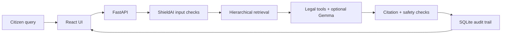
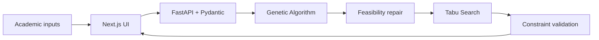
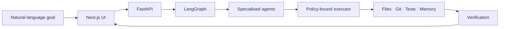

# Shubhi Dixit

Computer Science undergraduate at **Delhi Technological University (DTU)** passionate about **Artificial Intelligence, Distributed Systems, Competitive Programming, and Software Engineering**.

I enjoy solving algorithmic challenges, building intelligent systems, and applying AI to real-world problems through hands-on projects. I believe in learning by building and continuously exploring new technologies.

---

## Featured Projects

I enjoy building systems where AI and algorithms produce real, verifiable outcomes—not just text responses. These projects explore agentic execution, privacy-aware AI and combinatorial optimisation through complete frontend–backend applications.

---

## **NyayaBot + ShieldAI — Local-First Legal Action Engine**

A local-first legal assistance system that turns an English, Hindi or Hinglish grievance into grounded legal information, actionable procedures and draft documents.

  

### **Workflow**

`React UI` &nbsp;&nbsp;→&nbsp;&nbsp; `FastAPI` &nbsp;&nbsp;→&nbsp;&nbsp; `ShieldAI Input Guards` &nbsp;&nbsp;→&nbsp;&nbsp; `Hierarchical Legal Retrieval` &nbsp;&nbsp;→&nbsp;&nbsp; `Tool Workflow` &nbsp;&nbsp;→&nbsp;&nbsp; `Optional Gemma` &nbsp;&nbsp;→&nbsp;&nbsp; `Output Verification` &nbsp;&nbsp;→&nbsp;&nbsp; `SQLite Audit Trail`

- Uses hierarchical offline retrieval to first identify the relevant legal Act or domain and then narrow the result to supporting provisions.
- Combines local **TF-IDF retrieval** with an optional Ollama/Gemma layer; a deterministic fallback keeps the core workflows usable when the model is unavailable.
- Applies ShieldAI checks for prompt-injection patterns, configured PII masking, citation presence, grounding and mandatory legal disclaimers.
- Produces practical outputs such as procedure checklists, evidence records, case actions and downloadable legal-document drafts.
- Coordinates statutory search, procedure lookup, evidence handling, drafting and verification through a structured tool-driven workflow.
- Stores cases and actions across a relational SQLite design with explicit transactions, idempotency-key validation and compare-and-swap updates for conflict-safe writes.
- Records validation results and execution history so the final answer is traceable rather than presented as an unexplained model response.

<b>View architecture</b>

### **Tech Stack**

React • TypeScript• Python• FastAPI • SQLite• TF-IDF • Ollama • Gemma • ReportLab • Pytest

Build with Gemma Hackathon, AIMS-DTU

**Repository:** [NyayaBot](https://github.com/ShubhiDixit09/NyayaBot.ShieldAI)

---

## **ChronoSync — University Timetable Optimisation**

A full-stack scheduling platform that converts academic requirements into conflict-checked, preference-aware university timetables.

 

### **Workflow**

`Next.js UI` &nbsp;&nbsp;→&nbsp;&nbsp; `FastAPI + Pydantic` &nbsp;&nbsp;→&nbsp;&nbsp; `Genetic Algorithm` &nbsp;&nbsp;→&nbsp;&nbsp; `Feasibility Repair` &nbsp;&nbsp;→&nbsp;&nbsp; `Tabu Search` &nbsp;&nbsp;→&nbsp;&nbsp; `Validated Timetable + Metrics`

- Models university timetabling as an **NP-hard combinatorial optimisation problem** involving courses, faculty, rooms, laboratories, student groups and time slots.
- Separates hard constraints—such as faculty, room and student-group clashes—from soft objectives such as preferences and schedule quality.
- Uses a **Genetic Algorithm** to explore the global search space, followed by deterministic repair to remove remaining infeasibilities.
- Applies **Tabu Search** as a local-improvement stage to refine feasible schedules without repeatedly returning to recently explored solutions.
- Returns the generated timetable with conflict reports, warnings, fitness values and convergence information, making optimisation behaviour explainable.
- Provides typed health, sample-data, validation and generation APIs through FastAPI and Pydantic.
- Includes an interactive TypeScript dashboard for timetable filtering, resource views, generation controls and optimisation metrics.
- Packages the frontend and optimisation service through Docker Compose for reproducible local execution.

<b>View architecture</b>

### **Tech Stack**

Next.js • React • TypeScript • Python • FastAPI • Pydantic • Genetic Algorithms • Tabu Search • Docker

**Repository:** [ChronoSync](https://github.com/ShubhiDixit09/ChronoSync-updated)

---

## **SkillForge — Agentic AI Runtime**

A software-first runtime that converts natural-language goals into planned, permissioned and verified software actions.

  

### **Workflow**

`Next.js Dashboard` &nbsp;&nbsp;→&nbsp;&nbsp; `FastAPI` &nbsp;&nbsp;→&nbsp;&nbsp; `LangGraph Orchestrator` &nbsp;&nbsp;→&nbsp;&nbsp; `Specialised Agents` &nbsp;&nbsp;→&nbsp;&nbsp; `Bounded Tools` &nbsp;&nbsp;→&nbsp;&nbsp; `Verification` &nbsp;&nbsp;→&nbsp;&nbsp; `SQLite + Live SSE Events`

- Models each task as a stateful **plan → execute → verify** workflow instead of returning a single chatbot response.
- Routes steps across planning, coding, file, memory, execution and verification roles through central agent and tool registries.
- Executes workspace inspection, safe file reads, Git status, memory search and allow-listed test commands through a permissioned executor.
- Prevents path traversal and unrestricted shell access using workspace boundaries, command allow-lists, timeouts and output limits.
- Streams persisted workflow events to the dashboard using **Server-Sent Events**, making every step, failure and result observable.
- Works immediately in deterministic zero-key mode, with optional local **Gemma through Ollama** for evidence-grounded final synthesis.
- Redesigned from an initially hardware-dependent robotics system into an environment-independent runtime; ROS2, Gazebo and physical devices remain future adapters.

<b>View architecture</b>

### **Tech Stack**

Next.js • React • TypeScript • Python  • FastAPI • LangGraph • SQLite • SSE • Ollama • Docker • Pytest

**Repository:** [SkillForge](https://github.com/ShubhiDixit09/SkillForge-updated)

---

## Areas of Interest

### Artificial Intelligence & Machine Learning

- Machine Learning
- Deep Learning
- Retrieval-Augmented Generation (RAG)
- Agentic AI
- Computer Vision

### Competitive Programming

- Dynamic Programming
- Graph Algorithms
- Trees
- Binary Search
- Sliding Window
- Two Pointers
- Greedy Algorithms

---

## Tech Stack

### Languages

- C++
- Python
- JavaScript

### Frontend

- React.js
- HTML
- CSS

### Backend

- Node.js
- Express.js
- FastAPI

### Database

- MongoDB

### Core CS

- Data Structures & Algorithms
- Object-Oriented Programming
- Operating Systems

### AI / ML

- LangGraph
- OpenCV

### Tools & Platforms

- Git
- GitHub
- Rest APIs
- Canvas API

---

## Competitive Programming

I regularly practice Competitive Programming to strengthen problem-solving, algorithmic thinking, and the ability to design efficient algorithms under time constraints.

- **LeetCode:** **100+ Problems Solved**
- **Codeforces:** 20+ Problems Solved

---

## 🏆 Achievements

- **99.08 Percentile** in JEE Main
- **Qualified JEE Advanced**
- **1st Place** – Guessapalooza, IEEE DTU INVICTUS Annual Technical Fest *(₹3,000 Cash Prize)*
- **2nd Place** – State-Level Mental Mathematics Competition *(₹10,500 Cash Prize)*
- **Rank 12** – MVPP Delhi State Scholarship Examination among **20,000+ participants** *(₹5,000 Scholarship)*

---

## 📚 Currently Working On

- Strengthening problem-solving skills through Data Structures & Algorithms and Competitive Programming.
- Learning **Machine Learning, Deep Learning, Generative AI, RAG, and Multi-Agent AI** through hands-on projects.
- Building **SkillForge**, an extensible multi-agent AI runtime for intelligent automation.

---

## Connect

- [LinkedIn](https://www.linkedin.com/in/shubhi-dixit-dtu/)
- [LeetCode](https://leetcode.com/u/shubhi_dixit_09/)
- [Codeforces](https://codeforces.com/profile/shubhi.dixit.dtu)
